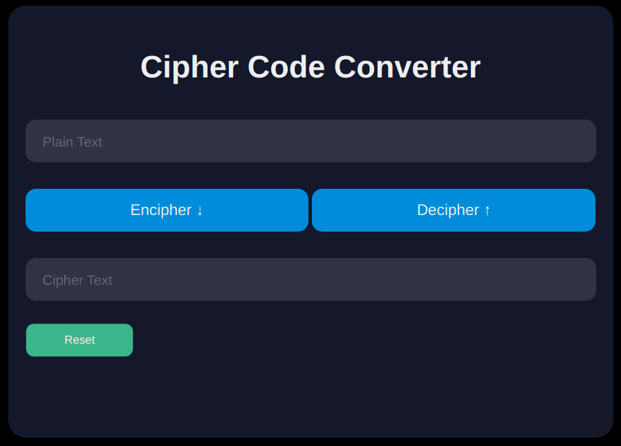
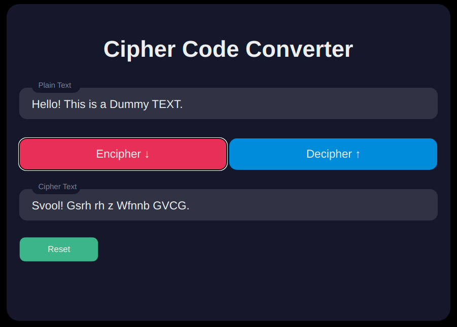
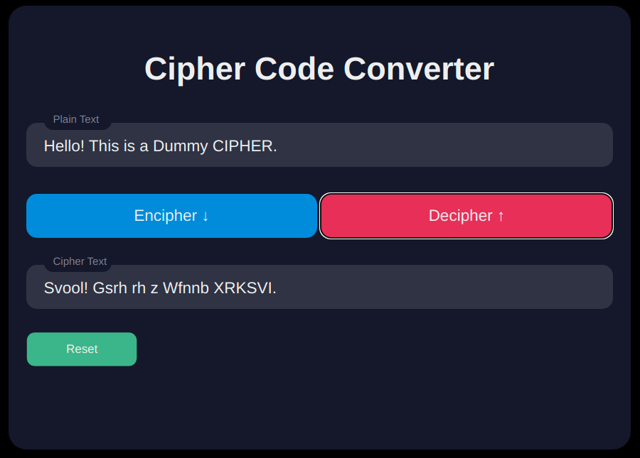

# Network Security: Practical Assignment 0 (PA0)

This is a program with a UI to Encipher / Decipher texts with Atbash Cipher encryption algorithm.
To run the program, just open the html file present in the "code" directory in your browser.

